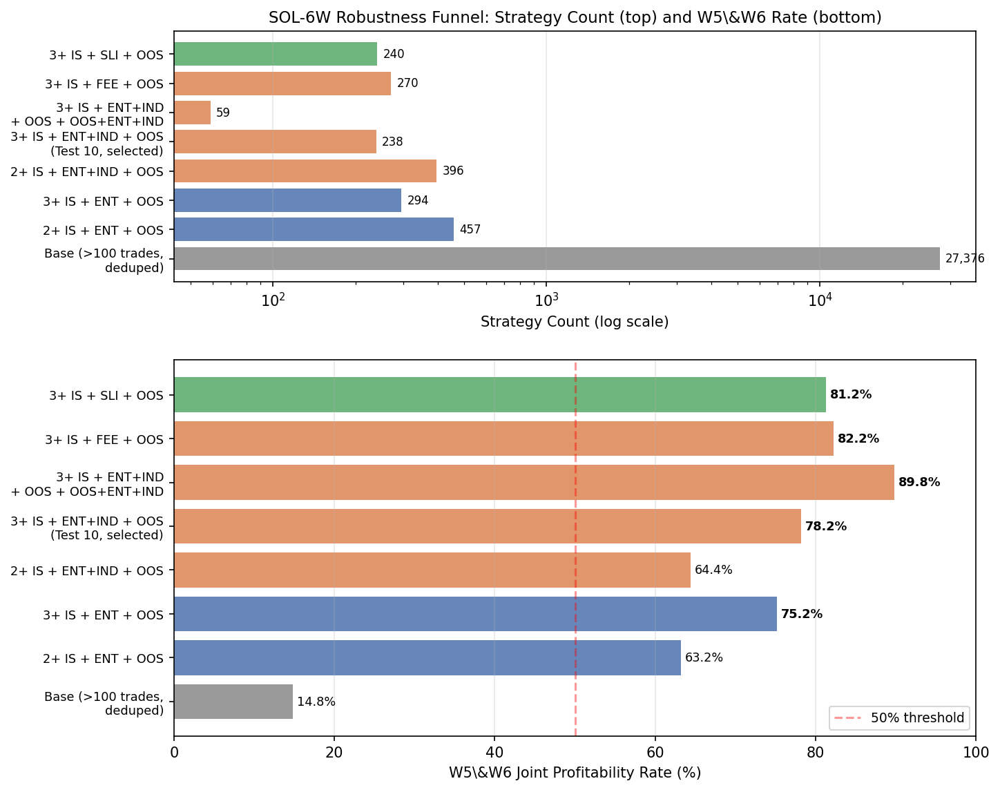

# Strategy Generalization Analysis

> **Research / educational use only. Not financial advice. Past backtest results do not guarantee future performance.**

Measures how well walk-forward-optimized (WFO) strategies generalize from historical windows into unseen "live proxy" windows. Reads the output produced by [`run_strategies.py`](https://github.com/DaruFinance/quant-research-framework/blob/main/runner/run_strategies.py) and answers the question: **given that a strategy passed your in-sample and robustness filters in the past, how often does it stay profitable going forward?**

---

## What It Looks Like

**Console — TEST ID MAPPING (prints before any files are read):**

```
==================== TEST ID MAPPING (preliminary) ====================

test 1: Strategies with >100 trades total (base IS+OOS across all windows) + deduped
    Meaning: Base quality gate: at least 100 total trades + deduplicated signatures.
    Requirements: No robustness data required.
    Eligible for manual export selection (robustness-required): NO

test 2: Strategies with 2 or more profitable windows (base) + IS+ENT + OOS
    Meaning: Robustness funnel: base >= 2 profitable IS windows, then IS+ENT and OOS must pass.
    Requirements: Requires IS+ENT and OOS lines (enable ENTRY_DRIFT = True).
    Eligible for manual export selection (robustness-required): YES

test 3: Strategies with 2 or more profitable windows (base) + IS+ENT + OOS + OOS+ENT
    Meaning: Robustness funnel: IS+ENT, OOS, and OOS+ENT must all pass.
    Requirements: Requires IS+ENT and OOS+ENT lines (enable ENTRY_DRIFT = True).
    Eligible for manual export selection (robustness-required): YES
...

------------------- BASE QUALITY GATE: >100 TRADES + DEDUP -------------------
  - Matched strategies: 412
  - Live proxy W5 profitable rate: 54.37%
  - Live proxy W6 profitable rate: 51.94%
  - Both live proxies profitable rate: 38.11%

Strategies with 2 or more profitable windows (base) + IS+ENT + OOS + OOS+ENT
  - Matched strategies: 238
  - Live proxy W5 profitable rate: 71.43%
  - Live proxy W6 profitable rate: 68.91%
  - Both live proxies profitable rate: 60.92%
```

**Robustness funnel — strategy count shrinks as filter tightens (real DOGE/USDT 30m data):**



**META sliding-window analysis — portfolio profitability across 13 market regimes (DOGE/USDT 30m):**


**Excel output** — the script writes `selected_pipeline_test_N_strategies.xlsx` with 5 sheets: strategy metrics, trade-list stats (excl. live / all windows / live only), and portfolio simulation results.

---

## Data Source

This tool consumes the output folders generated by the batch strategy runner
in my backtesting framework:

https://github.com/DaruFinance/quant-research-framework

---

## Why This Is Different

Most backtesting tools tell you *how good a strategy looks in-sample*. This tool asks a harder question: **does it keep working on data it never saw?**

- **Generalization measurement, not a backtest.** It takes finished WFO results and runs a second-pass analysis on held-out windows — the "live proxies" — that were never part of optimization.
- **Robustness funnels.** Strategies must survive multiple filter layers (IS pass → robustness-perturbed IS pass → OOS pass → robustness-perturbed OOS pass) before they're considered credible.
- **Beta-binomial lower bounds.** Instead of reporting a raw pass rate, the script reports a statistically conservative lower bound — so small sample sizes can't fool you into false confidence.
- **Decision-ready export.** One command produces an Excel workbook with ranked strategies, trade-list stats, and portfolio simulation results — ready for review without additional scripting.

## Features

- Sliding-window generalization analysis across all WFO windows
- Robustness funnel filters (IS + robustness tag + OOS + OOS robustness tag)
- Beta-binomial lower bound statistics for each filter pipeline
- Portfolio construction from top-ranked strategies
- Challenge-style pass rate simulation (milestone / drawdown / daily loss limits)
- META mode: re-runs across every possible window offset for temporal stability analysis
- Excel export with strategy metrics, trade-list derived stats, and portfolio results

## Requirements

```bash
pip install -r requirements.txt
```

| Package | Purpose |
|---------|---------|
| `numpy` | Numerical computation |
| `pandas` | Data loading and Excel export |
| `matplotlib` | Equity curve and distribution plots |
| `scipy` | Beta-binomial lower bound (statistical confidence) |
| `openpyxl` | Excel `.xlsx` output |

## Input: Strategy Files from run_strategies.py

This script reads the output folder produced by [`run_strategies.py`](https://github.com/DaruFinance/quant-research-framework/blob/main/runner/run_strategies.py). Each strategy subfolder must contain a `.txt` results file with lines in this format:

```
W01 IS   PF: 1.23  ROI: $456  Trades: 80  Win: 52.3%
W01 OOS  PF: 1.10  ROI: $210  Trades: 40  Win: 54.0%
W01 IS+ENT  PF: 1.18  ROI: $401  Trades: 80  Win: 51.2%
W01 OOS+ENT PF: 1.05  ROI: $180  Trades: 40  Win: 50.0%
```

The robustness-tagged lines (`IS+ENT`, `OOS+ENT`, etc.) are generated automatically when you enable robustness switches in `run_strategies.py`:

| Switch in run_strategies.py | Tag produced | Required for robustness tests |
|-----------------------------|--------------|-------------------------------|
| `ENTRY_DRIFT = True` | `ENT` | Yes |
| `INDICATOR_VARIANCE = True` | `IND` | Yes |
| `FEE_SHOCK = True` | `FEE` | Yes |
| `SLIPPAGE_SHOCK = True` | `SLI` | Yes |

> **You must enable at least one robustness switch** in `run_strategies.py` before running this analysis, otherwise no tests will be marked as eligible for export.

### Example input folder structure

```
MyRun/
├── EMA_x_EMA100_accel_SL2/
│   ├── EMA_x_EMA100_accel_SL2.txt
│   └── trade_list/
│       └── trade_list.csv
├── RSI_x_EMA50_atr_SL1.5/
│   ├── RSI_x_EMA50_atr_SL1.5.txt
│   └── trade_list/
│       └── trade_list.csv
└── ...
```

Each `.txt` file holds the per-window IS/OOS metrics. The `trade_list/` subfolder holds the raw trade log used for equity curve and drawdown calculations.

---

## Try It in 60 Seconds

No strategy data? Use the included sample data to verify the script runs end-to-end. Set these values in the `# CONFIG` section at the top of `strategy-generalization-analysis.py`:

```python
root_dir = "examples/sample_strategy_output"
EXPECTED_WINDOWS = 6
SELECT_TEST_NUMBER = 3
ENABLE_PLOTS = False
META_MODE = False
```

Then run:

```bash
python strategy-generalization-analysis.py
```

The TEST ID MAPPING prints immediately. After the file walk completes, per-pipeline stats print and an Excel file is written to `examples/sample_strategy_output/`.

> The sample folder has 2 strategies with `IS+ENT` / `OOS+ENT` lines. Portfolio results will be sparse — that is expected. Use your real data for meaningful output.

See [`examples/expected_outputs/`](examples/expected_outputs/) for a description of the output format.

---

## Quick Start

### Step 1 — Point to your strategies folder

Open `strategy-generalization-analysis.py` and set `root_dir` at the top of the CONFIG section:

```python
root_dir = r"C:\Strategies\MyRun"       # Windows
# root_dir = "/home/user/strategies/myrun"  # Linux/Mac
```

This must be the same folder you passed as `base_output` in `run_strategies.py`.

### Step 2 — Run once to see available tests

```bash
python strategy-generalization-analysis.py
```

Read the **TEST ID MAPPING** block. Each test shows its pipeline definition, what robustness data it requires, and whether it is eligible for export.

### Step 3 — Select a test and re-run

Set `SELECT_TEST_NUMBER` to a test ID marked `Eligible: YES`, then re-run:

```bash
python strategy-generalization-analysis.py
```

An Excel file is saved to `root_dir` with all passing strategies, trade-list stats, and portfolio results.

---

## Configuration Reference

All settings are in the `# CONFIG` section at the top of the script.

| Parameter | Default | Description |
|-----------|---------|-------------|
| `root_dir` | *(must be set)* | Path to your `run_strategies.py` output folder |
| `EXPECTED_WINDOWS` | `6` | Number of WFO windows per run (match your backtester setting) |
| `SELECT_TEST_NUMBER` | `10` | Which pipeline to export (see TEST ID MAPPING output) |
| `META_MODE` | `False` | Re-run across all sliding window offsets for temporal stability |
| `LIVE_MODE` | `False` | Re-apply filter without held-out live windows (deployment mode) |
| `ENABLE_PLOTS` | `True` | Show matplotlib plots (set `False` for headless/batch runs) |
| `PORTFOLIO_SIZE` | `20` | Strategies per sampled portfolio |
| `MAX_PORTFOLIO_COMBOS` | `10000` | Max portfolios to sample |
| `TOP_STRATEGIES_POOL` | `24` | Pool size for portfolio sampling (top-N by `TOP_STRATEGY_RANK_METRIC`) |
| `TOP_STRATEGY_RANK_METRIC` | `"pf"` | Ranking metric for pool selection: `"sharpe"`, `"pf"`, or `"maxdd"` |
| `USE_PCT_MODE` | `True` | Use % compounding for challenge stats instead of fixed R |
| `ACCOUNT_BALANCE` | `1000.0` | Starting balance for % mode |
| `RISK_PCT_PER_R` | `0.1` | % of equity risked per 1R trade (compounded) |

---

## Understanding the Tests

The script builds a set of **filter pipelines** (called "tests") and measures how often strategies passing each filter remain profitable in the live proxy windows.

- **Base quality gate** (`>100 trades + dedup`): strategies with enough trades and no duplicate signatures. No robustness data needed. Not eligible for the main export.
- **Robustness funnels** (`IS + IS+TAG + OOS`, `IS + IS+TAG + OOS + OOS+TAG`): strategies must pass both the base IS filter and the robustness-tagged version, in both IS and OOS. These are the eligible export tests.

The tighter the funnel (more conditions required), the smaller the surviving set — but typically a higher live-proxy pass rate.

---

## Output

The exported Excel file (`selected_pipeline_test_N_strategies.xlsx`) contains:

| Sheet | Contents |
|-------|----------|
| `All_Parsed_From_TXT` | All strategy metrics parsed from `.txt` files |
| `TradeList_ExclLive` | Trade-list stats excluding live proxy windows |
| `TradeList_AllWindows` | Trade-list stats across all windows |
| `TradeList_LiveOnly` | Trade-list stats for live proxy windows only |
| `Portfolios` | Sampled portfolio combinations with live-proxy stats |

---

## Common Gotchas

**"0 eligible tests" or all tests show `Eligible: NO`**
You ran the backtester without any robustness switches enabled. The analysis requires `IS+TAG` / `OOS+TAG` lines in your `.txt` files. Enable at least one switch in `run_strategies.py` (`ENTRY_DRIFT = True` is the easiest) and re-run the backtester.

**Windows paths cause errors**
Always use raw strings for Windows paths: `r"C:\Strategies\MyRun"`. A plain string with backslashes (`"C:\Strategies\MyRun"`) will silently mangle the path.

**`EXPECTED_WINDOWS` doesn't match your data**
This value must equal the number of WFO windows per strategy file (the `W01 / W02 / ...` count). If it's wrong the live-proxy window indices will be off and all strategies will have 0 live results.

**trade_list.csv not found / ignored**
The script expects the CSV at `<strategy_folder>/trade_list/trade_list.csv` exactly. The delimiter must be a comma. If the file is missing, trade-list derived stats (equity curves, MaxDD) are skipped for that strategy — the run still completes.

**`SELECT_TEST_NUMBER` out of range**
Run once first (without changing `SELECT_TEST_NUMBER`) to see the full TEST ID MAPPING, then pick a number that exists and is marked `Eligible: YES`.

**Plots block execution on some systems**
If the script hangs at a matplotlib window, set `ENABLE_PLOTS = False` in the config or run with a non-interactive backend: `MPLBACKEND=Agg python strategy-generalization-analysis.py`.

---

## Empirical Results

The [`results/`](results/) folder contains META sliding-window results from two real datasets:

| Dataset | WFO Windows | Sliding Runs | Key Finding |
|---------|-------------|--------------|-------------|
| DOGE/USDT 30m | 18 | 13 | 99–100% portfolio profitability in strong regimes; collapses to 8.9% in adversarial run. LB–profitability correlation ≈ 0.96. |
| BTC/USDT 30m | 24 | 19 | Strong runs 1–3 (99–100%), extended adversarial runs 4–13 (20–42%), recovery run 15 reaches 100% at +90.2% avg return. |

Full tables and charts: [`results/meta_results.md`](results/meta_results.md)

---

## Disclaimer

This tool is for **research and educational purposes only**. Nothing in this repository constitutes financial advice. Backtests and simulations do not guarantee future results. Use at your own risk.
